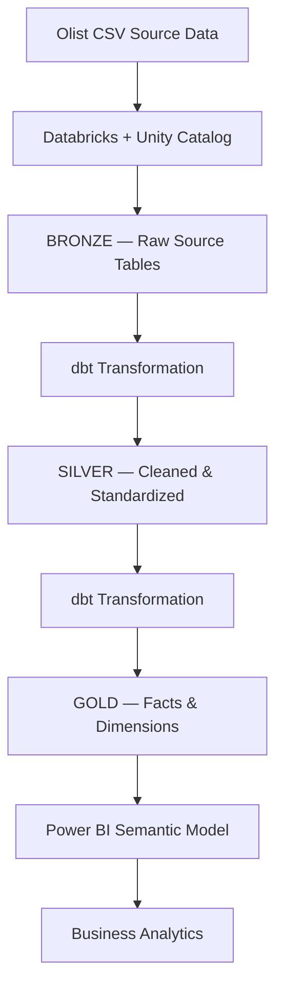

# Olist E-Commerce Analytics Platform


An end-to-end analytics engineering platform built on the **Olist Brazilian E-Commerce dataset**, using a **Bronze → Silver → Gold** lakehouse architecture (Databricks + Unity Catalog + dbt) to turn nine raw operational tables into a governed dimensional model consumed by Power BI.

This repo is written to be read from two angles: as an **analytics engineer**, you'll find the modeling decisions and data-quality reasoning behind each layer; as a **business analyst**, you'll find the metrics the Gold layer was built to answer and the insights actually pulled from it.

---

## Platform at a glance

| Metric | Value |
|---|---|
| Total Revenue | **R$13.59M** |
| Total Orders | **99K** |
| Total Customers | **96K** |
| Average Order Value | **R$137.75** |
| Repeat Customer Rate | **3.05%** |
| Average Review Score | **4.09 / 5** |
| Product Categories | **74** |

---

## Architecture



The medallion pattern keeps three concerns separate that are easy to accidentally tangle together: **fidelity to source** (Bronze), **correctness of types and values** (Silver), and **business meaning** (Gold). Each layer can be debugged, re-run, or re-modeled independently of the others.

### Dimensional model 


`
---

## For the analytics engineer: how each layer earns its place

**Bronze — don't touch the source of truth**
Raw Olist tables (`olist_customers_dataset`, `olist_orders_dataset`, `olist_order_items_dataset`, etc.) land in Unity Catalog untouched. Source-quality issues are *never* fixed here — they're handled downstream, so Bronze always stays reprocessable if a transformation rule turns out to be wrong.

**Silver — normalize before anyone reasons about it**
Staging models (`stg_orders`, `stg_products`, `stg_customers`, …) standardize types, handle nulls, normalize strings, and filter invalid records:

```sql
CAST(price AS DECIMAL(12,2))
CAST(order_purchase_timestamp AS TIMESTAMP)
WHERE order_id IS NOT NULL
```

This is the layer that absorbs how messy real operational data is, so Gold models never have to think about it.

**Gold — one governed answer per business question**
Facts and dimensions follow a star schema so BI tools (and analysts writing ad hoc SQL) get a single, join-friendly interface instead of reverse-engineering nine source tables every time.

**A real inconsistency worth flagging**
Building the dashboards below surfaced something an analytics engineer should catch: the *Sales Analysis* page's category breakdown totals R$13.59M with `health_beauty` on top, while the *Product Analysis* page's category donut totals only R$1.33M with `bed_bath_table` on top. Same field, two different filter contexts, two different "top category" answers. That's exactly the kind of semantic drift a single governed Gold model and a shared Power BI semantic layer — rather than page-level ad hoc filters — is meant to prevent. It's noted here as an open item rather than papered over.

**Data quality gates**
dbt tests enforce uniqueness on `customer_id`, `order_id`, `product_id`, `seller_id`, and validate accepted values on fields like `order_status` and `review_score`, run as part of every build:

```bash
dbt build
```

---


### Overview


- Revenue climbed steadily from January into a **May peak (~R$1.5M)**, then dropped sharply in **September (~R$0.6M)** before partially recovering by November — a pattern consistent across both the revenue trend and order-volume charts, suggesting a genuine demand shift rather than a reporting artifact.
- Average review score sits at **4.09**, indicating a generally satisfied customer base with room to investigate what's driving the lower-scoring tail.
- `health_beauty`, `watches_gifts`, and `bed_bath_table` consistently rank as the top three categories by sales.

### Sales Analysis


- **Payment behavior is heavily card-driven**: credit card accounts for **73.9%** of transactions, boleto **19.0%**, with voucher and debit card together under 2%.
- The overwhelming majority of orders are paid in a **single installment**, which combined with a modest R$137.75 average order value suggests customers are buying mid-ticket items outright rather than financing larger purchases.
- Revenue is long-tail across categories: the top category (`health_beauty`) holds only **9.26%** of total revenue, meaning no single category is a single point of failure for the business.

### Customer Analysis


- The standout number on this page: **repeat customers are just 3.05%** of the base (2.91K of 96K). This is the single biggest lever in the whole dataset — at this order volume and AOV, even a modest improvement in retention would move total revenue more than any acquisition-channel optimization.
- **Volume and value don't live in the same cities.** São Paulo and Rio de Janeiro dominate customer *count*, but the highest *average spend per customer* comes from smaller cities (Loreto, Pirpirituba, Barão Ataliba Nogueira) — a "top cities" dashboard sorted only by volume would miss where the highest-value customers actually are.

### Product Analysis


- `cama_mesa_banho` (bed/bath/table) is the most consistent performer — it leads **both** units sold and order count, meaning it's a genuinely high-frequency category rather than a high-price-per-unit skew.
- The `computers` category has by far the **highest average price** (~R$1K) despite low volume elsewhere on the page — it behaves as a premium, low-frequency category rather than a volume driver.
- The category revenue trend line shows `audio` spiking sharply in **August** (~R$150K, well above every other category) and collapsing immediately after — a strong signal of a one-off promotion or seasonal event worth investigating rather than treating as a stable trend.

---
## Some reccomendation


Payment is 74% credit card and almost entirely single-installment, yet AOV is only R$137.75. That combination usually means customers are buying safely within a "no-financing-needed" comfort zone. Testing installment options specifically on higher-ticket categories (computers, furniture_decor) could lift AOV without touching conversion on the cheap end.
Revenue is long-tail  the #1 category (health_beauty) is only 9.26% of total revenue. That's actually a resilience strength, but it also means there's no single "hero category" carrying growth. A cross-sell strategy (bundle bed_bath_table + housewares, both top performers) is more likely to move the needle than trying to make one category bigger.


The May peak and September crash (~1.5M → ~0.6M) repeat almost identically in both revenue and order-count charts, which rules out a pricing anomaly it's a demand or supply event. Before running a Q3 promo calendar, this is worth investigating: was Sept a stockout, a logistics disruption, or just seasonal? (You'd want delivery_status and inventory data joined in to confirm — not currently in the Gold model.)


The audio spike in August (~R$150K, dwarfing every other category) followed by an immediate crash is a strong signal of a one-off promo or viral moment. If you can identify what drove it, it's a replicable playbook for other stagnant categories rather than a one-time fluke.
computers has the highest average price but doesn't show up as a volume leader anywhere else — it behaves like a premium, considered-purchase category. Financing/installments (again, underused platform-wide) is the natural lever there.
Retention — the highest-leverage number on the whole platform


## Tech stack

| Area | Technology |
|---|---|
| Data Platform | Databricks |
| Governance | Unity Catalog |
| Transformation | dbt + SQL |
| Processing | Spark / PySpark |
| Data Modeling | Dimensional / Star Schema |
| BI | Power BI |
| Version Control | Git / GitHub |

---

## Project structure

```text
olist-databricks-lakehouse/
├── models/
│   ├── bronze/           # Raw source references (Unity Catalog)
│   ├── silver/            # stg_* cleaning & standardization models
│   └── gold/               # dim_* and fact_* models
├── tests/                     # dbt schema & data tests
├── macros/
├── powerbi/
│   └── dashboard_screenshots/
├── dbt_project.yml
└── README.md
```

---

## Getting started

```bash
# Clone
git clone https://github.com/faizan171103/olist-databricks-lakehouse.git
cd olist-databricks-lakehouse

# Configure your Databricks connection, then validate
dbt debug

# Build the full Bronze → Silver → Gold pipeline
dbt build

# Run data-quality tests in isolation
dbt test
```

---
---

## Author

**Mohd Faizanul Haque**
Analytics Engineering · Data Modeling · Business Intelligence
GitHub: [@faizan171103](https://github.com/faizan171103)
